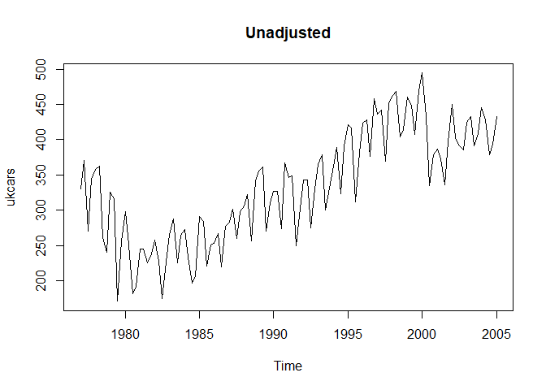
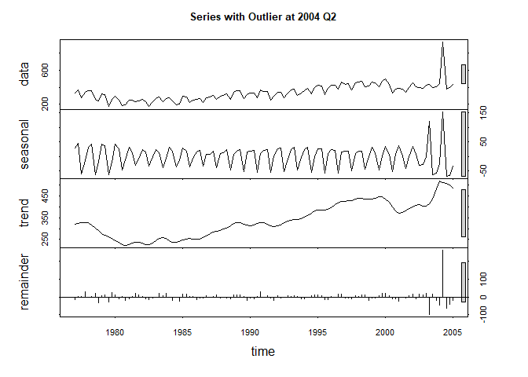

# Time Series Decomposition
Jack K. Rasmus-Vorrath  
July 27, 2017  

#The following analysis and visualization performs classical and STL decomposition of time series data on passenger vehicle production in the United Kingdom.

##Data Import from 'FPP' Library & Time Series Visualization

###The plot consists of 18 years (1977-2004) of data on quarterly production (in thousands of cars), demonstrating positive trend and annual seasonal fluctuation over the course of the interval.


```r
library(fpp)
```

```
## Loading required package: forecast
```

```
## Loading required package: fma
```

```
## Loading required package: expsmooth
```

```
## Loading required package: lmtest
```

```
## Loading required package: zoo
```

```
## 
## Attaching package: 'zoo'
```

```
## The following objects are masked from 'package:base':
## 
##     as.Date, as.Date.numeric
```

```
## Loading required package: tseries
```

```r
data(ukcars)
plot(ukcars, main = "Raw Time Series Data")
```

<!-- -->

##Classical Decomposition
###Trend cycle and seasonal indices were first calculated and visualized using classical decomposition, verifying the annual seasonal pattern and the range of the overall positive trend, with extrema at 1979 Q3 (171.153) and 2001 Q1 (494.311).


```r
fitd <- decompose(ukcars)
plot(fitd)
```

<!-- -->

##Seasonal Adjustment
###The analysis proceeded by computing and plotting the seasonally adjusted data, which no longer exhibits the characteristic annual peak-and-valley pattern of variation.


```r
cars_adj <- seasadj(fitd)
plot(ukcars, main = "Unadjusted")
```

<!-- -->

```r
plot(cars_adj, main = "Seasonally Adjusted")
```

<!-- -->

##EDA: Outlier Effects
###To observe its effects, an outlying value (+500) was added to the data for 1993 Q3 before recomputing the seasonal adjustment, which leaves intact the unusual (non-seasonal) peak of the data point in the subsequent comparative visualization.


```r
cars2 <- ts(c(ukcars[1:66],ukcars[67]+500,ukcars[68:113]),start=c(1977,1),frequency=4)

ukcars[65:68]
```

```
## [1] 364.521 378.448 300.798 331.757
```

```r
#Now becomes:

cars2[65:68]
```

```
## [1] 364.521 378.448 800.798 331.757
```

```r
fitd2 <- decompose(cars2)
cars_adj2 <- seasadj(fitd2)

plot(cars2, main = "Unadjusted")
```

<!-- -->

```r
plot(cars_adj2, main = "Seasonally Adjusted")
```

<!-- -->

##EDA (Part 2): Outlier Effects
###By comparison, the outlying value (+500) was instead added to the data for 2004 Q2 before recomputing the seasonal adjustment, which reproduces the same unusual peak at the end of the time series. While calculation of a moving average may be affected by the location of an outlier with respect to a given time window, the seasonal adjustment is made to the entire length of time series, leaving the effect unaltered.


```r
cars3 <- ts(c(ukcars[1:109],ukcars[110]+500,ukcars[111:113]),start=c(1977,1),frequency=4)

ukcars[109:112]
```

```
## [1] 445.458 428.202 379.048 394.042
```

```r
#Now becomes:

cars3[109:112]
```

```
## [1] 445.458 928.202 379.048 394.042
```

```r
fitd3 <- decompose(cars3)
cars_adj3 <- seasadj(fitd3)

plot(cars3, main = "Unadjusted")
```

<!-- -->

```r
plot(cars_adj3, main = "Seasonally Adjusted")
```

<!-- -->

##STL Decomposition
###As a final evaluation of features of the time series, seasonal and trend decomposition was performed using locally estimated scatterplot smoothing (LOESS), producing the comparative visualization of the three time series below.


```r
fit <- stl(ukcars, s.window = 5)
fit2 <- stl(cars2, s.window = 5)
fit3 <- stl(cars3, s.window = 5)

plot(fit, main = "Original Time Series")
```

<!-- -->

```r
plot(fit2, main = "Series with Outlier at 1993 Q3")
```

<!-- -->

```r
plot(fit3, main = "Series with Outlier at 2004 Q2")
```

<!-- -->

##For comparative visual assessment, overlaid fits of STL decomposition are applied to the original time series data, and to the two series including artificial outliers as well.


```r
par(mfrow = c(3,1))

plot(ukcars, main = "Original Time Series")
lines(fit$time.series[,2],col="red",ylab="Trend")

plot(cars2, main = "Series with Outlier at 1993 Q3")
lines(fit2$time.series[,2],col="red",ylab="Trend")

plot(cars3, main = "Series with Outlier at 2004 Q2")
lines(fit3$time.series[,2],col="red",ylab="Trend")
```

-1.png)<!-- -->
